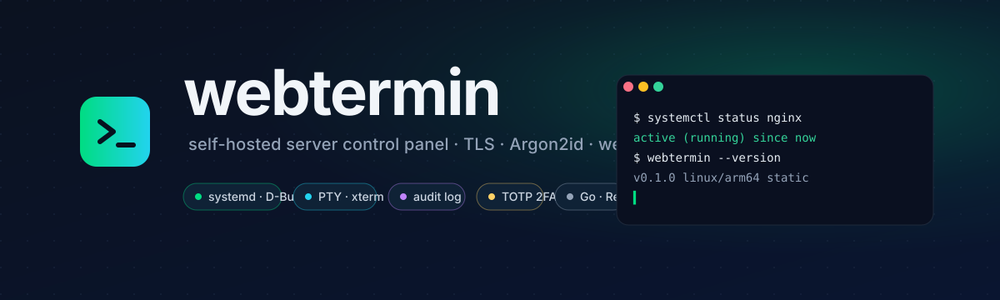
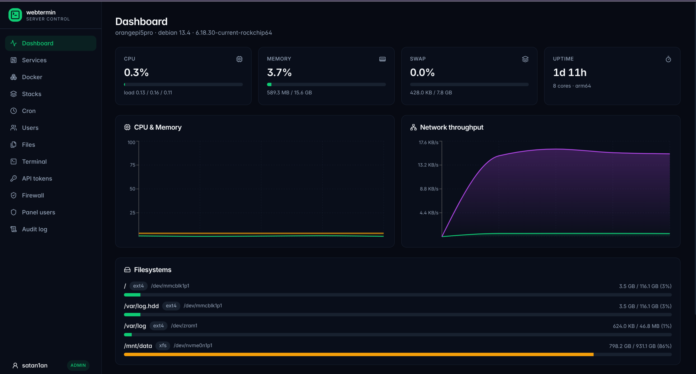
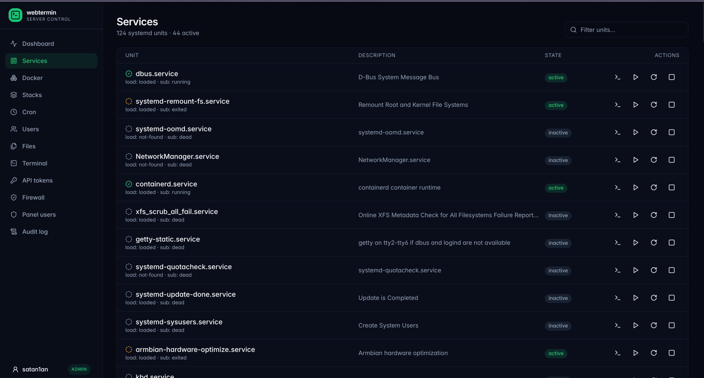
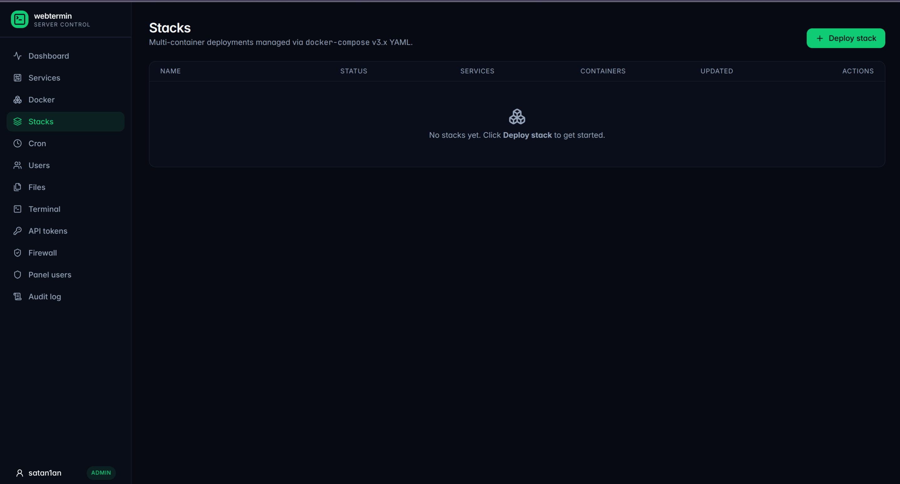
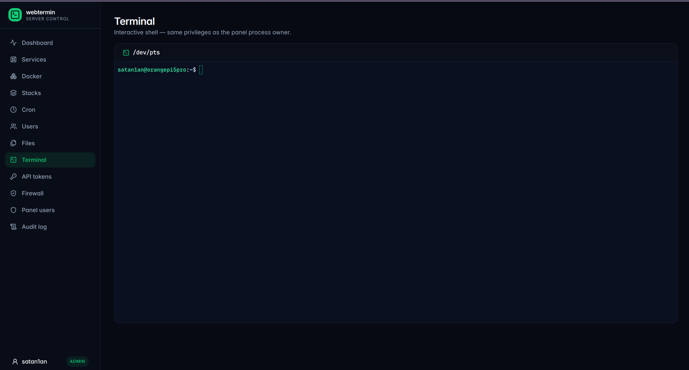
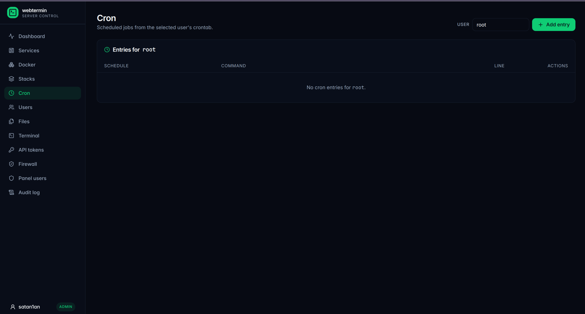
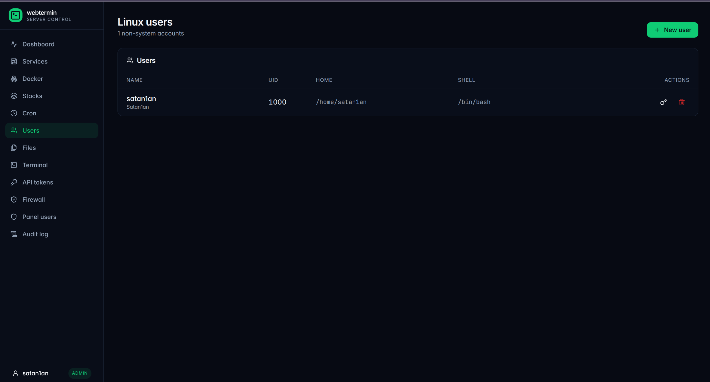
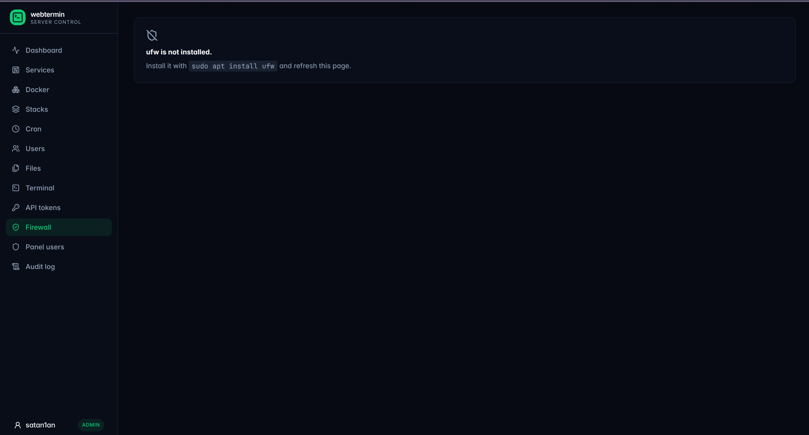

<div align="center">



<h3>A beautiful, secure, self-hosted alternative to Webmin for a single Linux server.</h3>

[](https://github.com/Satan1an/webtermin/actions/workflows/ci.yml)
[](https://github.com/Satan1an/webtermin/releases/latest)
[](LICENSE)
[](https://go.dev)
[](#install)

🌐 **English** · **[Русский](README.ru.md)**

</div>

---

**webtermin** is a single static Go binary with an embedded React SPA. It runs HTTPS-only out of the box, ships with first-run admin setup, Argon2id passwords, optional TOTP 2FA, CSRF-protected sessions, and a full audit log. Every system action goes through a typed allowlist — **no shell strings built from user input, ever**.

## Highlights

| | |
|---|---|
| ⚡ **One binary** | Static Go executable (~14 MB) with the React SPA embedded via `go:embed`. No runtime, no separate static server. Same binary across `.deb` / `.rpm` / `.apk` / Docker. |
| 🔐 **Security-first** | TLS by default · Argon2id · HttpOnly/Secure/Strict cookies · CSRF tokens · strict CSP · rate-limit + lockout · optional TOTP 2FA · RBAC (viewer / operator / admin) · API tokens with role scoping · OIDC SSO. |
| 📜 **Audit log** | Every mutating action recorded in SQLite — who, what, when, target, outcome, IP. Surfaced in-UI under `/audit`. |
| 🧩 **13 modules** | See [docs/modules.md](docs/modules.md). Systemd · Docker (Portainer-grade) · Compose stacks · cron · Linux users + SSH keys · files (Monaco) · PTY terminal · packages (apt/dnf) · firewall (ufw) · network (nmcli) · WireGuard · backups · panel users + tokens. |
| 🎨 **Modern UI** | React + Tailwind + shadcn/Radix · recharts · Framer Motion · dark by default · responsive. |
| 🏗️ **ARM-ready** | Cross-compiled for `linux/amd64` and `linux/arm64` (OrangePi, Raspberry Pi 4/5, ARM cloud VMs). |
| 📚 **Documented** | Per-module reference, complete API, OIDC + non-root setup walkthroughs, contributor guide — all under [`docs/`](docs/). |

## Screenshots

<p align="center">
  
</p>

<table>
<tr>
<td width="33%"></td>
<td width="33%"></td>
<td width="33%"></td>
</tr>
<tr>
<td></td>
<td></td>
<td></td>
</tr>
</table>

## Install

### Debian / Ubuntu / OrangePi / Raspberry Pi (.deb)

Grab the package for your architecture from the [latest release](https://github.com/Satan1an/webtermin/releases/latest):

```bash
# Replace VERSION with the tag (e.g. 0.1.0) and ARCH with amd64 or arm64.
VERSION=0.1.0
ARCH=$(dpkg --print-architecture)   # auto-detects amd64 / arm64
curl -fsSL -o webtermin.deb \
  "https://github.com/Satan1an/webtermin/releases/download/v${VERSION}/webtermin_${VERSION}_linux_${ARCH}.deb"
sudo apt install ./webtermin.deb
```

The .deb installs to `/usr/bin/webtermin`, drops a systemd unit at `/lib/systemd/system/webtermin.service`, creates `/var/lib/webtermin` for data and `/etc/webtermin/config.yaml` as a conffile (your local edits are preserved on upgrade), and starts the service.

Open **`https://<host>:8443`** to complete first-run setup.

### Docker

```bash
docker compose up -d --build
```

See [`docker-compose.yml`](docker-compose.yml) for the host bind-mounts and the `privileged: true` requirement — a container that manages the host needs that level of access. Treat the panel password like root SSH.

## Build from source

```bash
make build         # native binary for this host
make build-arm64   # cross-compile aarch64 (for OrangePi / RPi)
make docker        # local Docker image
make docker-arm64  # arm64 Docker image via buildx
```

Requires Go ≥ 1.25 and Node ≥ 22 (LTS).

## Configuration

The default config lives at `/etc/webtermin/config.yaml` (or `./config.yaml` when running standalone). All keys are commented in [`config.example.yaml`](config.example.yaml). The values you'll touch most often:

| Key | Default | Notes |
| --- | --- | --- |
| `server.listen` | `0.0.0.0:8443` | Bind `127.0.0.1` if you put nginx/Caddy in front. |
| `server.tls_cert` / `tls_key` | _empty_ | Empty → self-signed cert auto-generated into `data_dir/tls/`. |
| `data_dir` | `/var/lib/webtermin` | Holds the SQLite DB, sessions, and generated certs. |
| `security.session_ttl_min` | `240` | Session lifetime in minutes. |
| `security.require_2fa` | `false` | Force TOTP enrollment for every user. |
| `security.max_login_attempts` | `5` | Per-IP failure count before lockout. |
| `terminal.default_shell` | _empty_ | Fallback shell for the web terminal. |

After editing: `sudo systemctl restart webtermin`.

## Documentation

| | |
|---|---|
| **Modules reference** — [`docs/modules.md`](docs/modules.md) | Every module, what it does, which role can read / write, audit-log namespaces. |
| **HTTP API** — [`docs/api.md`](docs/api.md) | Complete endpoint list grouped by module. The reference for anyone scripting webtermin via API tokens. |
| **OIDC SSO setup** — [`docs/oidc-setup.md`](docs/oidc-setup.md) | Concrete walkthrough using Authentik as the worked example. |
| **Non-root deployment** — [`docs/non-root-setup.md`](docs/non-root-setup.md) | sudoers + docker-group recipe for least-privilege deployments. |
| **Contributing** — [`docs/contributing.md`](docs/contributing.md) | Repo layout, build / test / lint, the pattern for adding a new module. |

## Security model

- **Transport** — HTTPS only, TLS 1.2+, HSTS 2y, X-Frame-Options DENY, strict Content-Security-Policy.
- **Auth** — Argon2id (64 MiB, t=2, p=2). Session IDs are 256-bit, random, HttpOnly + Secure + SameSite=Strict. CSRF token required on every mutating request. Optional per-user TOTP 2FA. Rate-limit + lockout on failed logins. RBAC with three hierarchical roles. API tokens with per-token role scoping. Optional OIDC SSO sign-in.
- **System actions** — Every action lives behind a typed allowlist. Unit names match `^[A-Za-z0-9@_.\-:\\]+\.(service|socket|...)$`; usernames match `^[a-z_][a-z0-9_-]{0,31}$`; file paths must be absolute, cleaned, and free of `..`. **No shell strings constructed from user input** — `useradd`, `chpasswd`, `journalctl`, `ufw`, `wg`, `nmcli`, `apt-get` etc. are invoked with argv slices via `os/exec`.
- **Audit** — every mutating action writes to `audit_log` (user, IP, action, target, outcome, detail). Surfaced under `/audit` in the UI.
- **Process** — runs as root by default; for least-privilege deployments see [docs/non-root-setup.md](docs/non-root-setup.md). systemd unit hardening: `ProtectKernelTunables=true`, `ProtectKernelModules=true`.

### Audit history

A manual review + `govulncheck` sweep was performed before tagging v0.1.0
(2026-05-16): grep audit of `exec.Command` argv usage, SQL parameterization,
file modes, cookie attributes; deep review of auth, CSRF, WebSocket origin,
path safety, and command exec. Results and the by-design trade-offs are
documented in [SECURITY.md](SECURITY.md#pre-release-audit-v010-2026-05-16).

Each subsequent release (v0.2 → v0.9) added unit tests for the new module's
validators; `go test -race`, `staticcheck`, `gosec` (HIGH), `govulncheck`,
and `gitleaks` all run on every CI build.

Found a vulnerability? See [SECURITY.md](SECURITY.md).

## Roadmap

Initial v0.1 → v0.9 roadmap is **complete**. Highlights of what shipped:

- ✅ RBAC (viewer / operator / admin) + last-admin guard
- ✅ API tokens with role-clamping at issue time
- ✅ OIDC SSO (Authentik / Authelia / Keycloak / Auth0 / …)
- ✅ Cron, firewall (ufw), network (nmcli), WireGuard, packages (apt/dnf)
- ✅ Portainer-grade Docker module + Compose stacks
- ✅ Backups (tar.gz of `/etc/webtermin` + `/var/lib/webtermin` + custom paths)
- ✅ Non-root mode (sudoers + docker group)
- ✅ `.deb` / `.rpm` / `.apk` packages + multi-arch ghcr.io Docker image
- ✅ Russian-language README + SECURITY

Post-1.0 ideas (gather user feedback first):

- [ ] Backup scheduling via systemd timers
- [ ] Wi-Fi management (`nmcli dev wifi …`)
- [ ] 24h Dashboard history (rrdtool-style)
- [ ] Email / webhook alerts on selected audit events
- [ ] Compose: image build from `build:` directive, healthcheck, secrets
- [ ] Docker: registry credentials, events stream, volume content browser

PRs welcome — see [docs/contributing.md](docs/contributing.md). Open an
issue first for anything non-trivial.

## License

[MIT](LICENSE) © 2026 Satan1an
